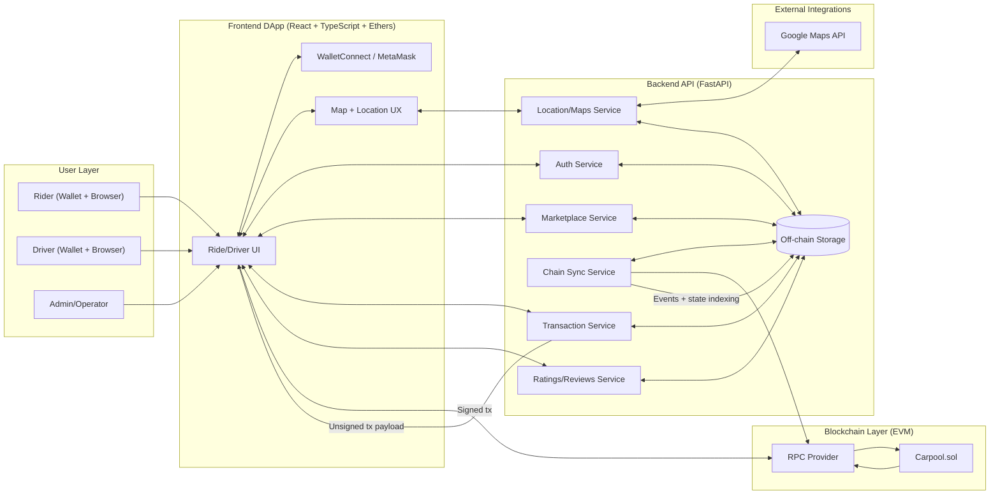
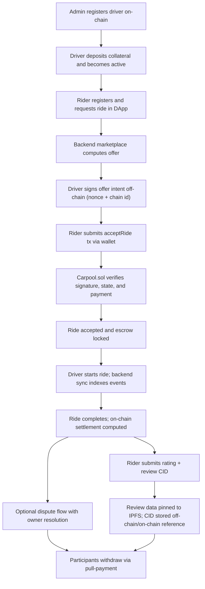

<table>
<tr>
<td>

# nChainRide: Decentralized Ride-Sharing DApp

nChainRide is a full-stack Web3 ride-sharing platform that combines trustless on-chain settlement with practical off-chain application services. The project is built around a hybrid architecture in which Ethereum smart contracts enforce financial integrity and lifecycle correctness, while backend and frontend systems deliver matching, location-aware UX, and operational orchestration.

</td>
<td>


</td>
</tr>
</table>
## Team Members
| Team Member | Roll Number |
| --- | --- |
| Divyae Arya | 240001027 |
| Eshwar Chandra | 240003029 |
| Arnav Birari | 240041004 |
| Yash Bhamare | 240041040 |
| Bhagyesh Kothalkar | 240041024 |
| Ninad Kulkarni | 240002032 |

## Project Context
The core objective of nChainRide is to reduce dependence on centralized trust for payment and dispute logic in ride-hailing workflows. The system places escrow, settlement, cancellation, and dispute resolution on-chain, while retaining off-chain execution for high-frequency and privacy-sensitive processes. This design keeps critical value transfer auditable and deterministic without sacrificing usability.

## Repository Overview
The repository is organized into four primary areas. The `contracts` directory contains Solidity contracts and Foundry tests, including the optimized contract and a baseline contract used for gas comparison. The `backend` directory contains FastAPI services for authentication, marketplace flow, transaction preparation, chain synchronization, ratings, and location services. The `frontend` directory contains the primary React and TypeScript DApp used for wallet-connected interaction. The `reports` directory contains gas and coverage artifacts together with a written optimization explanation.

## System Architecture
At the on-chain layer, `Carpool.sol` manages driver onboarding, collateral-backed activation, rider registration, ride acceptance with signature validation, ride lifecycle transitions, settlement accounting, disputes, and ratings. At the backend layer, FastAPI services coordinate off-chain ride workflows and prepare transaction payloads that are signed in the wallet. At the frontend layer, the DApp exposes rider and driver journeys with transaction feedback, wallet connectivity, and map-driven interaction using Google Maps integration. For decentralized metadata persistence, review payloads and ride-related artifacts can be stored on IPFS with content hashes referenced in backend records and on-chain fields where applicable.

### Detailed System Diagram


### End-to-End Workflow Diagram


## Contract Design and Lifecycle
The contract models driver, rider, and admin roles through explicit state transitions and guarded execution paths. Drivers are registered by the owner, funded with collateral, and activated once minimum requirements are met. Riders register on-chain and accept driver offers by submitting a valid driver signature over contextual parameters that include nonce and chain identifier, which prevents replay across contexts. Accepted rides are started by the assigned driver with route and ETA metadata, completed through deterministic settlement logic, and optionally disputed if required. Settlement follows a pull-payment design where balances are credited first and withdrawn by recipients later, which reduces transfer-related risk during business logic execution.

## Security Posture
The security model is based on layered controls that combine role restrictions, validation checks, and transfer safety patterns. Privileged actions are protected through ownership access control. ETH-moving functions are protected by reentrancy guards. Signature verification is used to authenticate ride acceptance intent. Per-driver nonces are incremented to prevent replay. Strict status and value checks are enforced on all major state transitions. Funds are distributed through queued withdrawals rather than direct push transfers during complex transitions.

## Data Strategy: On-Chain vs Off-Chain
nChainRide deliberately stores only operational and financially relevant state on-chain. Privacy-sensitive or high-volume data remains off-chain. Personal details are not written to the blockchain, and descriptive payloads are intended to remain in backend or external storage systems, with hash references used when integrity proof is needed. This strategy improves privacy posture, controls gas costs, and keeps contract state focused on verifiable settlement logic.

## Technology Stack
The smart contract layer uses Solidity with Foundry tooling and OpenZeppelin primitives, including `Ownable`, `ReentrancyGuard`, and `ECDSA`-related utilities. The frontend uses React, TypeScript, Vite, Ethers.js, and wallet connectivity through MetaMask and WalletConnect/Reown AppKit. Location and mapping flows are integrated through Google Maps API. The backend uses Python, FastAPI, Pydantic, and Pytest, with `uv` used for dependency and runtime workflow.

## Local Setup and Run
You should first ensure that Node.js, npm, Foundry, Python 3.11+, `uv`, and a browser wallet such as MetaMask are available locally. From the repository root, initialize and test the contracts with:

```bash
forge install
forge build
forge test -vv
```

Start the backend with:

```bash
cd backend
uv sync
uv run uvicorn app.main:app --reload
```

Start the frontend with:

```bash
cd frontend
npm install
npm run dev
```

## Environment Configuration
The backend expects runtime configuration such as `DATABASE_URL`, `JWT_SECRET`, `CARPOOL_CONTRACT_ADDRESS`, and `CHAIN_RPC_URL`, alongside module-specific flags. The frontend expects values such as `VITE_API_BASE_URL`, `VITE_CONTRACT_ADDRESS`, `VITE_WALLETCONNECT_PROJECT_ID`, and the Google Maps API configuration required by the current integration.

## Testing and Quality Artifacts
Contract-level testing is executed with Foundry and validates core success paths together with authorization and revert behavior. Backend testing is executed with Pytest and covers service and API behavior across domain modules. Frontend tests can be run through the project test script. The repository includes gas and coverage artifacts in `reports/gas-report.txt` and `reports/coverage-report.txt`, along with a concrete optimization write-up in `reports/gas-optimization-explanation.md` comparing baseline and optimized contract behavior.

## Known Limitations
- The current contract models only single-rider rides and does not support pooled/shared trips.
- Route geometry, rich trip metadata, and identity documents are intentionally kept off-chain; only compact hashes/operational settlement fields are stored on-chain.
- NatSpec note: `@return` tags are provided for functions that return values. Void public/external functions intentionally do not include `@return` because they have no return parameters in Solidity.
